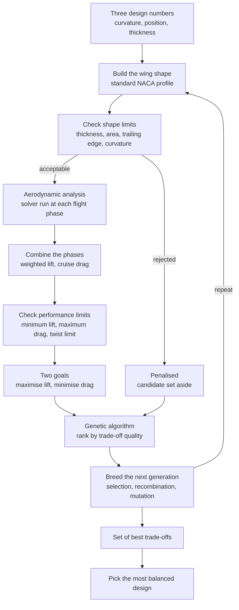
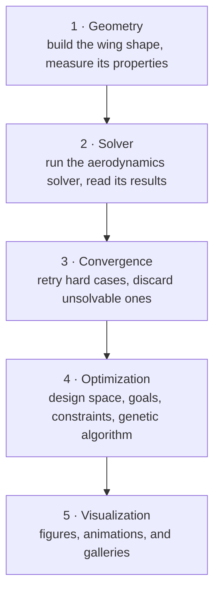
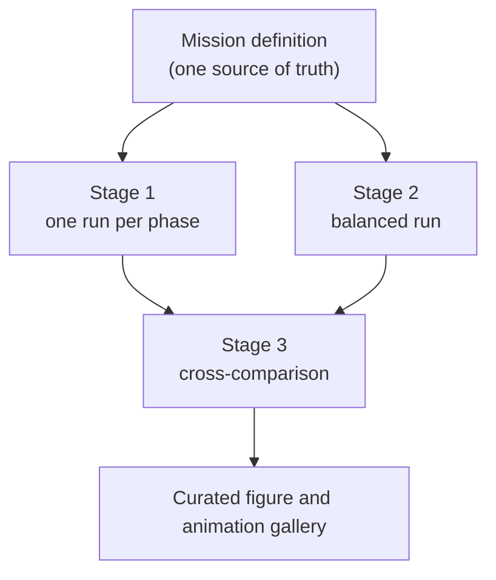

## The Challenge: Optimizing an Airfoil Across an Entire Flight Mission

An airfoil is never designed for a single operating condition. Throughout a flight mission, it must perform efficiently across a wide range of aerodynamic regimes: low-speed phases requiring high lift during takeoff and landing, followed by high-speed cruise conditions where minimizing drag becomes the primary driver of aerodynamic efficiency.

These requirements are inherently conflicting. Geometries that maximize lift at low speeds often incur drag penalties during cruise, while airfoils optimized for low drag at high speeds may exhibit less favorable characteristics during slower phases of flight. Airfoil design therefore becomes a multi-objective optimization problem, where the goal is not to maximize a single performance metric, but to identify the best compromise across multiple operating conditions.

Exploring this design space presents a significant challenge. High-fidelity simulations can provide accurate predictions, but their computational cost makes the systematic evaluation of thousands of candidate geometries impractical. Conversely, traditional trial-and-error approaches only explore a small fraction of the available design space.

This project addresses the problem through an automated evolutionary optimization framework. Thousands of airfoil geometries are generated, evaluated using an aerodynamic solver, and iteratively refined through genetic algorithms to identify designs that achieve the most effective balance of aerodynamic performance across the entire flight envelope.

## What this project does, in 60 seconds

What This Project Does in 60 Seconds

I developed a Python toolkit, `aeroforge`, that automates the design of airfoil shapes for a realistic flight mission composed of three phases: takeoff, cruise, and landing.

Each geometry is described compactly using three parameters (camber, camber position, and thickness). Its aerodynamic performance is then evaluated using a validated aerodynamic solver. An evolutionary optimization algorithm, inspired by natural selection, evolves a population of shapes to progressively improve trade-offs between lift and drag across the entire flight envelope.

Rather than producing a single solution, the method generates a set of optimal trade-offs. In engineering terms, this set is known as a Pareto front: each solution on this front represents a balance such that improving lift necessarily degrades drag performance, and vice versa. From this set, the toolkit also identifies a reference configuration representing a globally well-balanced compromise.

<figure>
  
  <figcaption><strong>Figure 1.</strong> The four winning profiles, each the recommended design of a separate optimization run: one tuned only for take-off, one only for cruise, one only for landing, and one balanced across all three. The high-lift phases favour thick, strongly curved shapes, while cruise favours a thin, almost flat one.<em>(Click any figure to open it full size.)</em></figcaption>
</figure>

### Key results

The pipeline runs four full optimization campaigns in a single workflow: three are each specialized for a specific flight phase, while a fourth targets a global trade-off across takeoff, cruise, and landing. In total, approximately three thousand candidate geometries are evaluated and systematically compared.

Each run does not produce a single solution, but a Pareto front, i.e., a set of optimal trade-offs between lift and drag. From this set, a representative reference airfoil is also selected as the most balanced design. Every candidate is evaluated using a viscous aerodynamic solver, `XFOIL`.

The effect of specialization is clearly visible. The cruise-optimal airfoil is thin and weakly cambered, the landing-optimal design is thicker and strongly cambered, while the balanced configuration deliberately lies between these extremes, reflecting a multi-mission compromise.

### Technologies used

`Python 3.10+` · `XFOIL` aerodynamics solver · `NSGA-II` genetic algorithm via `pymoo` · `NumPy` · `Matplotlib` · `imageio` for animations, all wrapped in an object-oriented, tested, documented codebase.

### Project highlights

The toolkit is built as five independent layers (geometry, solver, convergence, optimization, and visualization) that can each be tested and replaced on their own. It encodes genuine engineering requirements, both manufacturing and structural limits on the shape and aerodynamic limits on its performance. It handles candidate shapes that the solver cannot evaluate by detecting and discarding them, so the search never stalls. And it turns the entire optimization history into a set of clear figures and animations that explain not just what the optimizer chose, but why.

## Visual summary

<figure>
  
  <figcaption><strong>Figure 2.</strong>This figure illustrates the evolution of the balanced optimization process.
On the left, the performance space is shown, where moving to the right corresponds to increasing drag (worse performance) and moving upward corresponds to increasing lift (better performance). The amber curve represents the current Pareto front, i.e., the set of best trade-offs identified so far. The navy star marks the recommended design, while gray points correspond to previously evaluated geometries. Red crosses indicate candidates that failed to satisfy one or more constraints.
On the right, the same population is visualized in the space of shape parameters. The evolution of the population is clearly visible as it moves toward the high-lift, low-drag region and progressively concentrates along a well-defined trade-off curve.</figcaption>
</figure>

<figure>
  
  <figcaption><strong>Figure 3.</strong>Why a single airfoil is not sufficient.
Each bar cluster represents an optimized airfoil, and each group corresponds to a different flight phase. The cruise-optimized design performs best in cruise conditions but provides insufficient lift during landing. The landing-optimized design achieves the highest lift but suffers from increased drag during cruise. The balanced design avoids extreme weaknesses in any single phase, making it more suitable for a complete flight mission where robustness across conditions is required.</figcaption>
</figure>

<figure>
  
  <figcaption><strong>Figure 4.</strong>Pareto front comparison across optimization strategies.
This figure overlays the final Pareto fronts obtained from all optimization runs into a single representation, with each recommended design highlighted by a star.
Because each single-phase optimization targets a specific flight condition, their Pareto fronts occupy distinct regions of the lift–drag space. The multi-point (balanced) optimization forms the connecting structure between them, bridging the performance trade-offs across the entire envelope of flight conditions.</figcaption>
</figure>

In one sentence the optimizer independently rediscovers a classical aerodynamic design principle stating that high lift favors strong camber and significant thickness while low drag requires thinner and less cambered shapes and then it precisely quantifies the trade-offs required to achieve good performance across an entire flight mission.

## Table of contents

- [Project overview](#project-overview)
- [The engineering challenge](#the-engineering-challenge)
- [Aerodynamic background](#aerodynamic-background)
  - [Airfoil geometry: curvature, curvature position, thickness](#airfoil-geometry-curvature-curvature-position-thickness)
  - [The aerodynamic coefficients](#the-aerodynamic-coefficients)
  - [Reynolds number](#reynolds-number)
  - [Mach number](#mach-number)
  - [Putting it together: the mission](#putting-it-together-the-mission)
- [How the optimization works](#how-the-optimization-works)
- [The design space](#the-design-space)
- [Objectives and constraints](#objectives-and-constraints)
- [Trade-offs and the Pareto front](#trade-offs-and-the-pareto-front)
- [The optimization algorithm](#the-optimization-algorithm)
- [Running the aerodynamics solver](#running-the-aerodynamics-solver)
- [Optimizing across the whole mission](#optimizing-across-the-whole-mission)
- [Results](#results)
- [What the results teach us](#what-the-results-teach-us)
- [Software architecture](#software-architecture)
- [Technical skills demonstrated](#technical-skills-demonstrated)
- [Further reading](#further-reading)
- [Repository](#repository)
- [Conclusion](#conclusion)

## Project overview

Early in aircraft design, engineers must survey a wide region of the wing-shape space quickly. High-fidelity tools, the Reynolds-averaged Navier–Stokes simulations used later in a programme, resolve the flow in full but are far too costly to evaluate thousands of candidates. What the conceptual stage needs is a solver fast enough to sweep the design space and physically faithful enough that the rankings it produces can be trusted.

This project builds that capability around XFOIL, a viscous-inviscid solver for two-dimensional sections. XFOIL couples a potential-flow model of the outer flow to an integral boundary-layer formulation, so it captures the viscous physics that sets most of the drag, including transition and the onset of separation, while still returning a converged polar in well under a second. That speed is what makes it viable inside an optimization loop. The engineering contribution lies in driving it automatically and reliably across thousands of evaluations, and in turning its raw output into quantities a designer can reason about.

`aeroforge` is the toolkit I built for this. It is organised as five decoupled layers: geometry generation, solver execution, convergence management, optimization, and visualization. The case study on this page is a single end-to-end pipeline that exercises every layer, mapping three design variables all the way to a converged Pareto front and an animated record of how it formed.

The objectives were concrete: couple a population-based optimizer to a real external solver without corrupting either, encode a representative multi-phase mission rather than a single design point, produce a Pareto front and a defensible recommended design under genuine geometric and aerodynamic constraints, and generate reproducible figures that expose the reasoning behind the optimizer's choices.

## The engineering challenge

A wing develops lift by accelerating the flow over its upper surface and decelerating it underneath, establishing a pressure difference that integrates to a net upward force. It pays for that lift through drag, which decomposes into three contributions: skin-friction drag from the viscous shear in the boundary layer, pressure (or form) drag from the way the boundary layer alters the effective shape the outer flow sees, and, once the local flow approaches the speed of sound, wave drag from compressibility and shocks.

The conflict between lift and drag is intrinsic to the physics. Adding camber and thickness raises the lift a section produces, but it also loads the boundary layer with a stronger adverse pressure gradient, thickening it and increasing drag. A thin, weakly cambered section is efficient in cruise yet cannot reach the lift coefficients a wing needs at low speed. Push the loading too far at a given speed and the boundary layer separates, the section stalls, and lift and control are lost together.

No aircraft operates at a single condition. It rotates off the runway at low speed and high incidence, where maximising lift matters and drag is tolerable; it cruises fast and lightly loaded for hours, where drag governs fuel burn directly; then it lands slowly at high lift, where drag is actually useful for deceleration. A section optimised for cruise alone cannot take off; one optimised for take-off alone wastes fuel in cruise. This is why the problem is irreducibly multi-objective, and why its natural output is a family of compromises rather than a single optimum.

## Aerodynamic background

Every quantity in this section maps onto something concrete in the code: a design variable, an objective, a constraint, or an operating point. None of it is generic theory added after the fact.

### Airfoil geometry: curvature, curvature position, thickness

The project parameterises sections with the classic NACA 4-digit family, a standard analytic description that needs only three numbers. Those three numbers are the design variables the optimizer is free to vary.

The first is the **maximum camber** $m$, the peak height of the mean camber line relative to the chord. Camber lets a section generate lift at zero incidence and shifts its whole lift curve upward; increasing it raises lift but also tends to add drag and a stronger nose-down pitching moment.

The second is the **position of maximum camber** $p$, the chordwise station where that peak occurs. It redistributes the loading along the chord and influences where the adverse pressure gradient becomes critical, and hence where separation and stall begin.

The third is the **maximum thickness** $t$, expressed as a fraction of the chord. Thickness provides the internal volume a real wing needs for structure and fuel, and it conditions stall character: thin sections stall abruptly as the suction peak collapses, thicker ones more gradually, at the cost of some additional drag.

These three numbers are expanded into the analytic NACA surface and discretised into a smooth panelled geometry. They constitute the entire design space the optimizer searches.

### The aerodynamic coefficients

The solver reports performance through dimensionless coefficients, formed by normalising forces and moments by dynamic pressure and chord, so that sections can be compared independently of size and speed.

The **lift coefficient** $C_l$ quantifies lift and is the objective the optimizer maximises. The **drag coefficient** $C_d$ quantifies drag and is the objective it minimises. The **pitching-moment coefficient** $C_m$ measures the nose-up or nose-down moment about the quarter-chord; it is not optimized but is bounded, because a strongly pitching section forces the horizontal tail to carry a large trim load. Their ratio, the **lift-to-drag ratio** $L/D = C_l/C_d$, is the single most compact measure of aerodynamic efficiency: in steady cruise, range is directly proportional to it through the Breguet relation.

### Reynolds number

$$Re = \frac{\rho\,U\,c}{\mu}$$

The Reynolds number is the ratio of inertial to viscous forces in the flow, and it governs the state of the boundary layer, the thin viscous region adjacent to the surface. At the low values typical of take-off and landing, the boundary layer stays laminar over more of the chord, transitions later, and separates more readily, so the section behaves very differently than at the higher values of cruise. Because XFOIL resolves the boundary layer and its transition explicitly, the same geometry yields different lift and drag at each phase, which is much of what makes a multi-phase formulation physically meaningful rather than a relabelling of one condition.

### Mach number

$$M = \frac{U}{a}$$

The Mach number is the ratio of flight speed $U$ to the local speed of sound $a$, and it sets the importance of compressibility. At low Mach the flow is effectively incompressible; as cruise Mach is approached, compressibility amplifies the suction peak and steepens the pressure gradients, and beyond the critical Mach number local supersonic pockets terminated by shocks add wave drag. The solver applies a compressibility correction, so cruise is evaluated at its true Mach number while the low-speed phases are evaluated at theirs. This is a further reason the cruise-optimal section differs from the low-speed optimum.

### Putting it together: the mission

The three phases convert the lift–drag conflict into concrete operating points. Each phase is specified by an angle of attack, a Reynolds number, a Mach number, and a weight encoding how much it counts in the overall objective.

| Flight phase | Angle of attack $\alpha$ | Reynolds $Re$ | Mach $M$ | Importance weight |
|---|---|---|---|---|
| **Take-off** | 8° | $5\times10^5$ | 0.15 | 1.0 |
| **Cruise** | 2° | $2\times10^6$ | 0.60 | 1.5 |
| **Landing** | 10° | $4\times10^5$ | 0.15 | 1.2 |

Take-off and landing are high-incidence, low-speed, high-lift conditions. Cruise is low-incidence, high-speed, and efficiency-critical, which is why it carries the largest weight. No single geometry can be simultaneously optimal at a 2° cruise and a 10° low-speed landing, and the project demonstrates this directly by optimising each phase in isolation and showing that the resulting sections are genuinely distinct (Figure 1).

## How the optimization works

The complete loop is shown below. Each box corresponds to a real component in the codebase.

In sequence: three design variables define a section; the geometry is screened against manufacturing and structural limits; feasible candidates are analysed by the solver at every operating point; the per-phase results are aggregated into a mission lift and a cruise drag; these feed two competing objectives and three performance constraints; NSGA-II ranks the population by non-dominated sorting, breeds the next generation, and the loop repeats. After the final generation a single balanced design is extracted from the front.

## The design space

The optimizer searches a deliberately compact three-dimensional space, small enough to visualise in full yet rich enough to express the lift–drag conflict.

| Variable | Symbol | Lower | Upper | Meaning |
|---|---|---|---|---|
| Maximum camber | $m$ | 0.00 | 0.95 | how curved the centreline is |
| Camber position | $p$ | 0.10 | 0.80 | where along the chord the curvature peaks |
| Thickness | $t$ | 0.01 | 0.40 | maximum thickness relative to length |

These three continuous variables map onto an analytic NACA section, so a thickness near the middle of its range corresponds to a section of roughly 12% thickness-to-chord, and so on. The NACA family was chosen because it is smooth, analytically defined, and well conditioned for optimization: every point in the box is a realisable, manufacturable section, which keeps the search from drifting into degenerate geometries.

## Objectives and constraints

The optimizer pursues two objectives simultaneously. The first maximises **mission lift**, the importance-weighted sum of the lift coefficient over the phases,

$$C_{L,\text{mission}} = \sum_i w_i\,C_{l,i},$$

so cruise dominates the aggregate. The second minimises **cruise drag**, evaluated at the primary phase. Drag is judged at a single condition because it is only physically meaningful at one operating point, whereas lift is the aggregate the aircraft must produce across the mission. The two objectives oppose one another, which is what makes the problem genuinely multi-objective.

Beyond the objectives, every design must satisfy a set of constraints. The first group concerns the geometry itself and applies at every phase, since a section must be buildable and structurally adequate regardless of operating point.

| Shape limit | Requirement | Why it matters |
|---|---|---|
| Minimum thickness | thick enough overall | the wing needs internal volume and stiffness |
| Local thickness near the nose | thick enough at the front | room for a structural spar near the leading edge |
| Minimum enclosed area | large enough cross-section | a proxy for fuel and structural volume |
| Trailing edge not too open | nearly closed at the back | a sharp trailing edge has to be manufacturable |
| Curvature kept sane | within a bound | a structural and aeroelastic sanity limit |

The second group concerns performance and is phase-dependent, because each phase imposes different demands.

| Performance limit | Requirement | Why it matters |
|---|---|---|
| Minimum lift | enough lift at this phase | the aircraft must actually carry its weight here |
| Maximum drag | not too draggy | rejects inefficient outliers |
| Twist limit | bounded pitching moment | limits how hard the tail must work to trim the aircraft |

The thresholds are set per phase. Take-off and landing demand high lift and tolerate drag, while cruise demands low drag and only modest lift. For the balanced run the lift requirement is the weighted mission total relaxed by a small margin, strict enough to be meaningful yet loose enough to keep a populated feasible region. Any design violating a constraint is penalised and progressively driven out of the population through the ranking.

## Trade-offs and the Pareto front

With two competing objectives there is no single optimum but a set of them. The organising concept is **dominance**: one design dominates another if it is at least as good in both objectives and strictly better in one. The feasible designs that no other feasible design dominates form the **Pareto front**, the boundary of the achievable lift–drag region. It is the amber curve in Figure 2.

The shape of the front is itself the engineering result. A steep segment means lift can be bought cheaply in drag; a flat segment means the last increment of lift costs heavily in drag. Presenting the entire front, rather than collapsing it into a single weighted score chosen in advance, keeps the final decision with the engineer and makes the true cost of every compromise explicit.

This also motivates the choice of a genetic algorithm over the gradient-based methods common in optimization. Each evaluation comes from an external solver with no analytic derivatives, the responses carry mild numerical noise, and some geometries cannot be evaluated at all. Gradient methods cope poorly with all three. A population-based, derivative-free method tolerates noise, recovers the whole front in a single run, and degrades gracefully when individual evaluations fail.

## The optimization algorithm

The optimizer is NSGA-II, a well-established multi-objective genetic algorithm, accessed through the [pymoo](https://pymoo.org/) library behind the project's own optimization layer. In the showcase it evolves a population of twenty-five designs over thirty generations with a fixed random seed, so the run is fully reproducible.

Its mechanism mirrors natural selection. Starting from a diverse random population, each generation ranks individuals by **non-dominated sorting**: the current non-dominated set forms the first front, the next-best set after those are removed forms the second, and so on. Within a front, a **crowding-distance** measure favours individuals in sparsely populated regions, which spreads solutions evenly along the front rather than letting them cluster. Binary tournament selection then chooses parents, simulated-binary crossover and polynomial mutation perturb their three variables to produce offspring, and parents and offspring compete together in an elitist step so the population never regresses. Every one of these stages is visible in the animations on this page.

Infeasible designs are always ranked below feasible ones, and among infeasible designs the least-violating come first, so the red infeasible points in Figure 2 are steadily squeezed out of the population.

After the final generation the toolkit recommends one design from the front: the point closest to the ideal, and unattainable, corner that would simultaneously achieve the best lift and the best drag. This compromise, the knee of the front, is marked with the navy star throughout the figures.

## Running the aerodynamics solver

XFOIL sits at the centre of every evaluation. It couples an inviscid panel solution of the outer flow to an integral boundary-layer model, and from their interaction it returns not only lift and drag but the full state of the boundary layer, including transition location and separation. That detail is valuable because it explains *why* one section outperforms another, not merely by how much. Being fast and extensively validated, it is well suited to running inside an optimization loop.

The practical difficulty is that some geometries the optimizer proposes are too aggressive for the solver to converge, for instance very thick or strongly cambered sections operating near stall. The pipeline handles these deterministically: when the solver cannot return a trustworthy result, the case is detected and discarded, assigned penalty values that rank it below the genuine candidates so the search proceeds without interruption. The pipeline also records how often this happens and why, whether a geometry failed the geometric screen, failed to converge, or violated a performance constraint, turning an otherwise opaque failure into a diagnostic statistic.

Several engineering details make this dependable. Optimizer-generated geometries sometimes carry awkward panel distributions, so each section is re-paneled before analysis and difficult cases are retried with a sequence of progressively gentler continuation strategies before being abandoned. Because the solver is an external program driven through a text interface, the toolkit manages that interaction, isolates each run, and parses the output robustly across platforms. A fast built-in surrogate solver ships alongside, so the entire workflow can be exercised and tested even without XFOIL installed.

The value of resolving the boundary layer is visible in the pressure diagnostics the solver returns for every winning design.

<figure>
  
  <figcaption><strong>Figure 5.</strong> The pressure along the surface of each winning design at every flight phase (solid lines for the upper surface, dashed for the lower). The high-lift winners show a sharper suction peak near the nose, which means more lift but also a steeper pressure rise that the surface airflow has to survive without separating. This is the underlying physics the optimizer is implicitly trading against.</figcaption>
</figure>

## Optimizing across the whole mission

A single operating point cannot represent an aircraft, so the pipeline runs in stages. It first optimises each phase in isolation, take-off, cruise, and landing, each under its own constraints; these runs establish the extremes, the best attainable section if only that phase mattered. It then runs a single balanced optimization whose lift objective is the importance-weighted mission total, with cruise as the phase at which drag is judged. This is the design required to perform everywhere. Finally it generates figures overlaying all four winners so the compromise the balanced design strikes against each specialist is immediately legible.

The aggregation of the phases is the engineering core of the project. Rather than designing four separate sections, the phases are weighted by importance, cruise dominant, and the blend is optimised. This mirrors how aircraft are actually designed, around a representative mission, with weights encoding the fact that hours in cruise outweigh seconds of rotation off the runway. Because the mission is declared in one place in the code, changing a weight or adding a phase is a minimal edit, and every figure, animation, and constraint updates with it.

<figure>
  
  <figcaption><strong>Figure 6.</strong> Performance curves, lift against angle and lift against drag, re-evaluated by the solver at each flight phase for three designs from the balanced run: the highest-lift extreme, the lowest-drag extreme, and the recommended balanced design. The recommended design stays in the efficient low-drag region in cruise while keeping usable lift at the low-speed phases.</figcaption>
</figure>

## Results

The figures below are selected from the run rather than dumped, each because it makes a specific point.

### The optimization, animated

<figure>
  
  <figcaption><strong>Figure 7.</strong> The shapes evolving. Each frame draws the current best trade-off shapes in amber, recent history faded in grey, and the recommended design in navy. The population visibly converges from a random scatter of sections into a tight family of efficient profiles, the design taking shape generation by generation.</figcaption>
</figure>

<figure>
  
  <figcaption><strong>Figure 8.</strong> A different view of the same run, linking all five quantities at once: the three shape numbers, the weighted lift, and the cruise drag. Each line is one design. As the generations pass, the best designs in amber and the recommended design in navy settle into a consistent pattern, revealing which ranges of the shape parameters produce the best balance.</figcaption>
</figure>

### Convergence and final fronts

<figure>
  
  <figcaption><strong>Figure 9.</strong> Convergence diagnostics, from left to right: the best achievable lift, the best achievable drag, the number of designs on the trade-off curve, and the hypervolume, a single scalar measure of front quality that rises as the set of trade-offs improves. The fact that the hypervolume keeps climbing confirms the run is genuinely improving rather than stagnating.</figcaption>
</figure>

<figure>
  
  <figcaption><strong>Figure 10.</strong> The final family of best trade-off shapes from the balanced run, with the recommended design highlighted. Reading along the curve corresponds to walking from thin, low-drag sections toward thick, high-lift ones, the trade-off made tangible as actual shapes.</figcaption>
</figure>

<figure>
  
  <figcaption><strong>Figure 11.</strong> Lift, drag, and efficiency at every flight phase for every shape on the trade-off curve, with the recommended design highlighted. It shows the full range of behaviour available and confirms the recommended design is balanced rather than extreme.</figcaption>
</figure>

### How the specialists differ

<figure>
  
  <figcaption><strong>Figure 12.</strong> The actual shape numbers of each winner. The pattern is unambiguous: the low-speed winners choose high curvature and thickness, the cruise winner chooses the thinnest, least curved section, and the balanced winner deliberately lands in between.</figcaption>
</figure>

<figure>
  
  <figcaption><strong>Figure 13.</strong> The take-off-only optimization converging toward thick, strongly curved, high-lift sections, the opposite corner of the design space from the cruise optimum, which is precisely the point.</figcaption>
</figure>

<figure>
  
  <figcaption><strong>Figure 14a.</strong> Cruise-only final state, with the curve sitting in the low-drag, modest-lift region.</figcaption>
</figure>

<figure>
  
  <figcaption><strong>Figure 14b.</strong> Landing-only final state, with the curve shifted to high lift while accepting much higher drag.</figcaption>
</figure>

The animation below closes the loop between shape and physics.

<figure>
  
  <figcaption><strong>Figure 15.</strong> The recommended design's cruise pressure distribution evolving across generations. As the optimizer refines the shape, the suction peak and the pressure recovery smooth into an efficient cruise pattern, the signature of a low-drag section.</figcaption>
</figure>

## What the results teach us

The most striking outcome is that the optimizer recovers known aerodynamics without being told it. Nothing in the formulation states that high lift requires camber and thickness or that low drag requires neither, yet the winners separate precisely along those lines (Figures 1 and 12). When a search treating the solver as a black box independently reproduces textbook trends, it is strong evidence that both the solver coupling and the constraint set are sound.

The results also identify thickness and camber as the dominant design levers, with the position of maximum camber acting as a finer adjustment. Across the parallel-coordinates and parameter views, those two variables account for most of the lift and drag variation, which tells a designer where effort is best spent.

The weighting clearly steers the compromise. Because cruise carries the largest weight and is where drag is judged, the balanced design leans toward cruise efficiency while retaining enough lift for the low-speed phases (Figures 3 and 6). Re-weighting the mission would visibly relocate the recommended design, and the framework makes that sensitivity straightforward to explore.

Finally, the project is a reminder that much of real engineering software lies in robustness rather than the headline algorithm. The substantive difficulty here was not NSGA-II but keeping the solver returning usable results on aggressive geometries. The machinery that detects, discards, and reports unconverged cases is what separates a run that finishes with a clean front from one that stalls partway through.

## Software architecture

`aeroforge` is structured as five decoupled layers. The optimization layer is unaware that a solver exists, and the solver layer is unaware of what an objective is. That separation is what lets the same showcase run on either the real solver or the built-in surrogate through a single change.

A few properties are worth highlighting for a software-minded reader. The mission and its labels live in one location that drives every figure. Operating points, results, and constraints are represented with typed data structures. The solver sits behind a common interface, so the real and surrogate backends are interchangeable. Unconverged cases are handled through explicit, typed error handling rather than silent failure. The whole run is reproducible from a fixed seed and a single command. The package ships with unit tests, linting and type-checking configuration, continuous integration, and full documentation, so it is organised like a maintained library rather than a one-off script.

## Technical skills demonstrated

This project draws together several disciplines. On the **aerodynamics side**: airfoil theory, boundary-layer reasoning, the roles of Reynolds and Mach number, mission analysis, and fluent use of a validated solver as an engineering instrument. On the **optimization side**: formulating a multi-objective problem, analysing Pareto trade-offs, configuring a genetic algorithm, handling constraints, and selecting a design from a continuum. On the **scientific-computing side**: vectorised numerical code, driving an external program reliably at scale, modelling with typed data structures, and disciplined failure handling, together with a coherent set of figures and animations generated entirely from the run history. And on the **software-engineering side**: a layered, object-oriented codebase with clean interfaces, testing, type checking, continuous integration, documentation, and reproducibility treated as first-class concerns.

## Further reading

This case study is meant to double as a learning map. Each reference below is chosen for what it teaches and how it connects to the project.

For airfoil theory and aerodynamics, *Theory of Wing Sections* by Abbott and von Doenhoff is the classic reference for the NACA families and their measured behaviour, and it is the place to understand exactly what the three shape numbers mean. *Fundamentals of Aerodynamics* by John D. Anderson is the standard introduction to how lift and drag arise, what the coefficients mean, and how Reynolds and Mach number come in, which is the vocabulary used throughout this page. NASA's technical reports on the NACA series and open university aerodynamics courses are good sources of primary data and derivations.

For the solver, Mark Drela's original XFOIL paper and the [official XFOIL documentation](https://web.mit.edu/drela/Public/web/xfoil/) explain the model that produces every number in the loop and the convergence behaviour the toolkit has to manage.

For optimization, the original NSGA-II paper by Deb and colleagues introduces the two ideas at the heart of the algorithm used here, and Deb's book *Multi-Objective Optimization Using Evolutionary Algorithms* covers Pareto fronts and decision-making as a coherent framework. The [pymoo documentation](https://pymoo.org/) shows the concrete tools this project configures.

For the scientific computing side, *Numerical Optimization* by Nocedal and Wright explains why gradient methods struggle on noisy, black-box problems and when derivative-free methods are the right choice, while the [NumPy](https://numpy.org/doc/) and [Matplotlib](https://matplotlib.org/stable/) documentation cover the numerical and plotting patterns the code relies on.

## Repository

The full source, including the geometry engine, the solver wrapper, the optimization layer, the visualization pipeline, and the showcase that generated every figure on this page, is open source under the MIT license.

The code lives at [github.com/vcaries/airfoil_optimization](https://github.com/vcaries/airfoil_optimization), with an architecture document, a step-by-step usage guide, and a documentation site. The entire gallery regenerates from a single command, and a built-in stand-in solver means anyone can reproduce the results whether or not they have XFOIL installed.

## Conclusion

No single section is optimal across take-off, cruise, and landing, because lift and drag are in direct conflict and each phase weights them differently. This project addresses that with a compact, interpretable design space, a validated aerodynamics solver evaluating every candidate across a weighted multi-phase mission, a genetic algorithm searching under genuine geometric and performance constraints, and an explicit rule for selecting one balanced design, all within a clean, layered, reproducible Python toolkit.

The outcome is a set of lift–drag trade-offs for each phase and for the blended mission, winners that separate along established aerodynamic lines, and a balanced design that refuses to fail badly anywhere, delivered as a coherent visual narrative. The hard part was never the optimizer. It was coupling a real external solver to a population-based search so the whole remains fast, keeps running when individual geometries cannot be converged, and stays reproducible, and then turning the optimization history into figures an engineer can reason from.

There is ample room to extend it. The solver layer could be replaced by a higher-fidelity simulation or a trained surrogate behind the same interface; the NACA parameterisation could give way to a richer shape description such as CST or B-splines for finer control; an outer loop or surrogate model could reduce the number of expensive evaluations; and the mission could grow to include robustness to off-design conditions, gusts, and manoeuvres. The architecture was built so that each of these is a contained change rather than a rewrite, which is the real point of treating engineering analysis as software.
