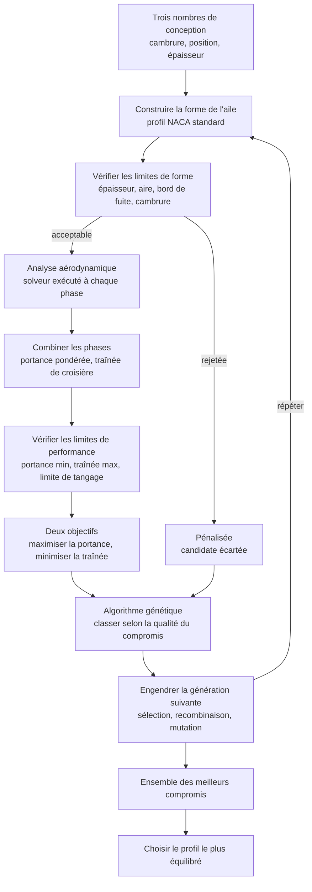
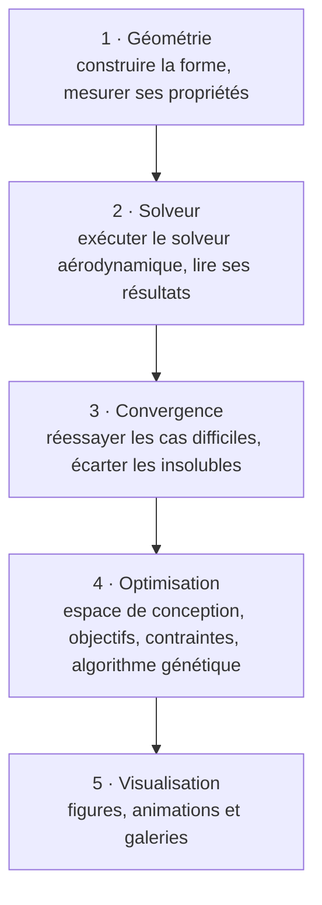
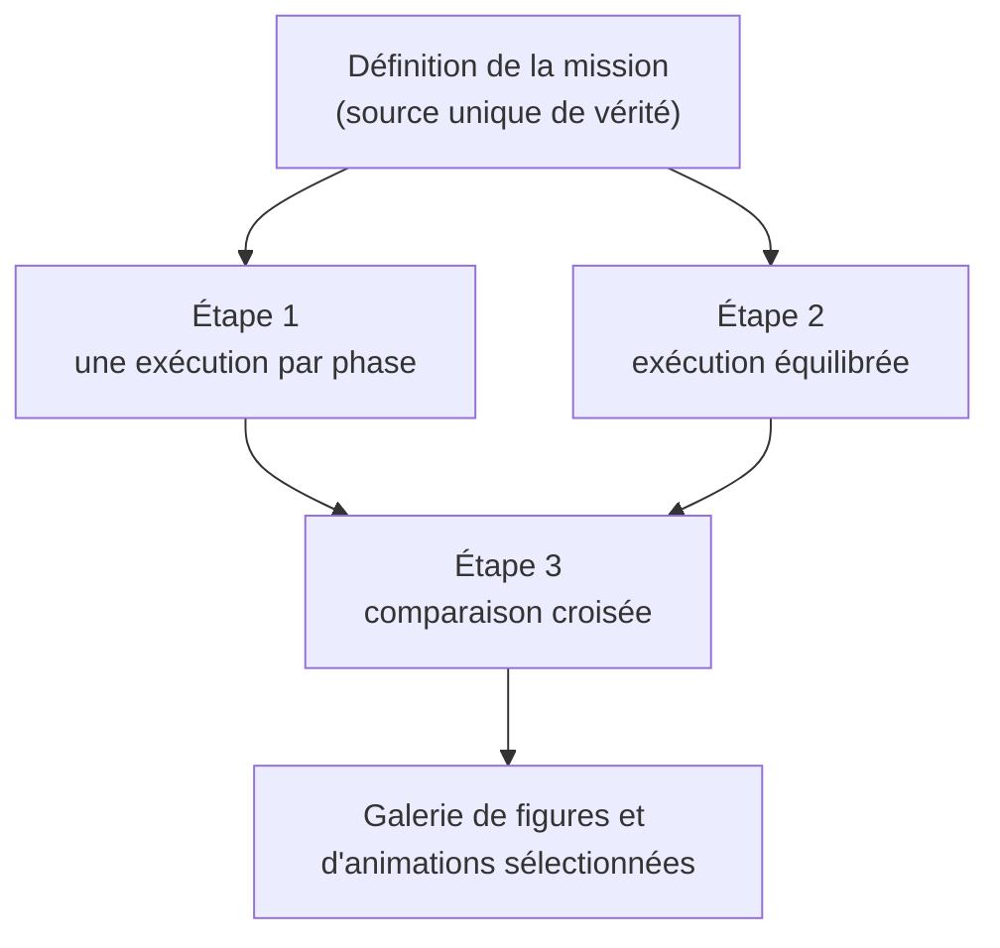

## Le défi : optimiser un profil d’aile sur l’ensemble d’une mission {#le-probleme}

Un profil d’aile n’est jamais conçu pour une seule condition de fonctionnement. Au cours d’une mission, il doit évoluer dans des régimes aérodynamiques très différents : phases à faible vitesse nécessitant une forte portance au décollage et à l’atterrissage, puis croisière à vitesse élevée où la réduction de la traînée devient le principal levier de performance énergétique.

Ces exigences sont souvent contradictoires. Les géométries favorisant la production de portance aux faibles vitesses tendent à pénaliser les performances en croisière, tandis que les profils optimisés pour minimiser la traînée à haute vitesse peuvent présenter des caractéristiques moins favorables lors des phases lentes du vol. La conception d'un profil d’aile relève donc d’un problème d’optimisation multi-objectifs dans lequel il s'agit de trouver le meilleur compromis entre plusieurs conditions de fonctionnement concurrentes.

Explorer cet espace de conception constitue un défi à part entière. Les simulations haute fidélité offrent une excellente précision mais restent trop coûteuses pour évaluer systématiquement des milliers de géométries candidates. À l’inverse, les approches fondées sur des itérations manuelles ne permettent d’explorer qu’une fraction limitée des solutions possibles.

Ce projet propose une approche automatisée basée sur l’optimisation évolutionnaire. Des milliers de profils sont générés, évalués par un solveur aérodynamique et sélectionnés au fil des générations afin d’identifier les géométries offrant les meilleurs compromis de performance sur l’ensemble de l’enveloppe de vol.

## Ce que fait ce projet en 60 secondes {#en-60-secondes}

J’ai développé une boîte à outils Python, `aeroforge`, qui automatise la conception de profils d’aile pour une mission de vol réaliste composée de trois phases : décollage, croisière et atterrissage.

Chaque géométrie est décrite de manière compacte à l’aide de trois paramètres (cambrure, position de cambrure et épaisseur). Ses performances aérodynamiques sont ensuite évaluées via un solveur validé. Un algorithme d’optimisation évolutionnaire, inspiré de la sélection naturelle, fait évoluer une population de formes afin d’améliorer progressivement les compromis entre portance et traînée sur l’ensemble du domaine de vol.

Plutôt que de fournir une solution unique, la méthode génère un ensemble de compromis optimaux. En ingénierie, cet ensemble est appelé front de Pareto : chaque solution qui s’y trouve correspond à un équilibre tel qu’améliorer la portance implique nécessairement de dégrader la traînée, et inversement. Parmi ces solutions, la boîte à outils identifie également une configuration de référence représentant un compromis globalement équilibré.

<figure>
  
  <figcaption><strong>Figure 1.</strong> Les quatre profils gagnants, chacun étant le profil recommandé d'une optimisation distincte : une réglée uniquement pour le décollage, une pour la croisière, une pour l'atterrissage, et une équilibrée sur les trois. Les phases à forte portance privilégient des formes épaisses et très cambrées, tandis que la croisière privilégie une forme fine, presque plate.<em>(Cliquez sur une figure pour l'ouvrir en grand.)</em></figcaption>
</figure>

### Résultats clés {#resultats-cles}

Le pipeline exécute quatre optimisations complètes de manière séquentielle : trois sont spécialisées chacune sur une phase de vol distincte, et une quatrième vise un compromis global entre décollage, croisière et atterrissage. Au total, environ trois mille géométries candidates sont évaluées et comparées de façon automatisée.

Chaque exécution ne produit pas une solution unique, mais un front de Pareto, c’est-à-dire un ensemble de compromis optimaux entre portance et traînée. À partir de ce front, un profil de référence est également sélectionné comme point d’équilibre le plus représentatif. Chaque candidat est évalué via un solveur aérodynamique visqueux, `XFOIL`.

La spécialisation des solutions est clairement observable. Le profil optimal pour la croisière est fin et faiblement cambré, celui optimisé pour l’atterrissage est plus épais et fortement cambré, tandis que le profil équilibré se positionne volontairement entre ces deux extrêmes, traduisant un compromis multi-mission.

### Technologies utilisées {#technologies}

`Python 3.10+` · solveur aérodynamique `XFOIL` · algorithme génétique `NSGA-II` via `pymoo` · `NumPy` · `Matplotlib` · `imageio` pour les animations, le tout dans une base de code orientée objet, testée et documentée.

### Points forts du projet {#points-forts}

La boîte à outils est construite en cinq couches indépendantes (géométrie, solveur, convergence, optimisation et visualisation) qui peuvent chacune être testées et remplacées séparément. Elle prend en compte à la fois des limites de fabrication et de structure sur la forme, et des limites aérodynamiques sur ses performances. Elle gère les formes candidates que le solveur ne parvient pas à évaluer en les détectant et en les écartant, de sorte que la recherche ne se bloque jamais. Et elle transforme tout l'historique de l'optimisation en un ensemble de figures et d'animations claires qui expliquent non seulement ce que l'optimiseur a choisi, mais pourquoi.

## Résumé visuel {#resume-visuel}

<figure>
  
  <figcaption><strong>Figure 2.</strong> Cette figure illustre l’évolution du processus d’optimisation multi-point.
À gauche, l’espace des performances est représenté, où un déplacement vers la droite correspond à une augmentation de la traînée (dégradation des performances) et un déplacement vers le haut à une augmentation de la portance (amélioration des performances). La courbe ambre représente le front de Pareto courant, c’est-à-dire l’ensemble des meilleurs compromis identifiés à un instant donné. L’étoile bleu marine indique le profil recommandé, tandis que les points gris correspondent aux géométries évaluées précédemment. Les croix rouges représentent les candidats ayant échoué à au moins une contrainte.
À droite, la même population est visualisée dans l’espace des paramètres géométriques. On observe clairement la dynamique d’évolution : la population converge progressivement vers la zone de forte portance et faible traînée, puis se structure le long d’une courbe de compromis bien définie.</figcaption>
</figure>

<figure>
  
  <figcaption><strong>Figure 3.</strong> Pourquoi un seul profil d’aile ne suffit pas ?
Chaque groupe de barres représente un profil optimisé, et chaque ensemble correspond à une phase de vol distincte. Le profil optimisé pour la croisière est le plus efficace dans cette condition, mais fournit une portance insuffisante à l’atterrissage. Le profil optimisé pour l’atterrissage atteint la portance la plus élevée, au prix d’une traînée pénalisante en croisière. Le profil équilibré évite les faiblesses marquées sur une phase donnée, ce qui en fait une solution plus adaptée à une mission complète où la robustesse sur l’ensemble du domaine de vol est essentielle.</figcaption>
</figure>

<figure>
  
  <figcaption><strong>Figure 4.</strong> Comparaison des fronts de Pareto entre stratégies d’optimisation.
Cette figure superpose les fronts de Pareto finaux obtenus pour l’ensemble des campagnes d’optimisation dans une seule représentation, chaque profil recommandé étant identifié par une étoile.
Comme chaque optimisation mono-phase cible une condition de vol spécifique, les fronts de Pareto associés occupent des régions distinctes de l’espace portance–traînée. L’optimisation multi-point forme une structure de liaison entre ces régions, en reliant les compromis de performance sur l’ensemble de l’enveloppe de vol.</figcaption>
</figure>

En une phrase : l’optimiseur retrouve de manière autonome un résultat classique de conception aérodynamique selon lequel la portance élevée favorise une forte cambrure et une épaisseur importante tandis que la réduction de la traînée impose des géométries plus fines et moins cambrées puis il quantifie précisément les compromis nécessaires pour obtenir de bonnes performances sur l’ensemble d’une mission de vol.

## Table des matières {#table-des-matieres}

- [Vue d'ensemble du projet](#vue-densemble)
- [Le défi d'ingénierie](#le-defi)
- [Notions d'aérodynamique](#aerodynamique)
  - [Géométrie du profil : cambrure, position de cambrure, épaisseur](#geometrie)
  - [Les coefficients aérodynamiques](#coefficients)
  - [Nombre de Reynolds](#reynolds)
  - [Nombre de Mach](#mach)
  - [Tout assembler : la mission](#mission)
- [Comment fonctionne l'optimisation](#fonctionnement)
- [L'espace de conception](#espace-de-conception)
- [Objectifs et contraintes](#objectifs-contraintes)
- [Les compromis et le front de Pareto](#front-de-pareto)
- [L'algorithme d'optimisation](#algorithme)
- [Exécuter le solveur aérodynamique](#solveur)
- [Optimiser sur toute la mission](#optimiser-mission)
- [Résultats](#resultats)
- [Ce que les résultats nous apprennent](#enseignements)
- [Architecture logicielle](#architecture)
- [Compétences techniques démontrées](#competences)
- [Pour aller plus loin](#pour-aller-plus-loin)
- [Dépôt](#depot)
- [Conclusion](#conclusion)

## Vue d'ensemble du projet {#vue-densemble}

Tôt dans la conception d'un avion, les ingénieurs doivent balayer rapidement une vaste région de l'espace des formes d'aile. Les outils haute fidélité, les simulations Navier–Stokes moyennées (RANS) utilisées plus tard dans un programme, résolvent l'écoulement dans son intégralité mais sont bien trop coûteux pour évaluer des milliers de candidats. Ce qu'exige l'étape de conception préliminaire, c'est un solveur assez rapide pour balayer l'espace de conception et assez fidèle physiquement pour que les classements qu'il produit soient dignes de confiance.

Ce projet construit cette capacité autour de XFOIL, un solveur visqueux pour les profils d'aile 2D. XFOIL couple un modèle d'écoulement potentiel pour l'écoulement extérieur à une formulation intégrale de la couche limite, de sorte qu'il capture la physique visqueuse qui fixe l'essentiel de la traînée, y compris la transition et l'apparition du décollement, tout en renvoyant une polaire convergée en bien moins d'une seconde. C'est cette rapidité qui le rend viable à l'intérieur d'une boucle d'optimisation. La contribution d'ingénierie consiste à le piloter automatiquement et de façon fiable sur des milliers d'évaluations, et à transformer sa sortie brute en quantités qu'un concepteur peut interpréter.

`aeroforge` est la boîte à outils que j'ai construite pour cela. Elle est organisée en cinq couches découplées : génération de la géométrie, exécution du solveur, gestion de la convergence, optimisation et visualisation. L'étude de cas de cette page est un pipeline complet de bout en bout qui sollicite chaque couche, depuis trois variables de conception jusqu'à un front de Pareto convergé et un enregistrement animé de sa formation.

Les objectifs étaient concrets : coupler un optimiseur à un véritable solveur externe sans corrompre ni l'un ni l'autre, encoder une mission représentative à plusieurs phases plutôt qu'un point de conception unique, produire un front de Pareto et un profil recommandé défendable sous de véritables contraintes géométriques et aérodynamiques, et générer des figures reproductibles qui exposent le raisonnement derrière les choix de l'optimiseur.

## Le défi d'ingénierie {#le-defi}

Une aile développe de la portance en accélérant l'écoulement sur sa surface supérieure et en le ralentissant en dessous, établissant une différence de pression dont l'intégrale donne une force ascendante nette. Elle paie cette portance par de la traînée, qui se décompose en trois contributions : la traînée de frottement, due au cisaillement visqueux dans la couche limite, la traînée de pression (ou de forme), due à la façon dont la couche limite modifie la forme effective que voit l'écoulement extérieur, et, dès que l'écoulement local approche la vitesse du son, la traînée d'onde, due à la compressibilité et aux chocs.

Le conflit entre portance et traînée est intrinsèque à la physique. Ajouter de la cambrure et de l'épaisseur augmente la portance qu'une section produit, mais charge aussi la couche limite d'un gradient de pression adverse plus fort, l'épaississant et augmentant la traînée. Une section fine et faiblement cambrée est efficace en croisière mais ne peut pas atteindre les coefficients de portance dont une aile a besoin à basse vitesse. Poussez la charge trop loin à une vitesse donnée et la couche limite se décolle, la section décroche, et la portance comme le contrôle se perdent ensemble.

Aucun avion ne fonctionne à une seule condition. Il décolle à basse vitesse et forte incidence, où maximiser la portance compte et où la traînée est tolérable ; il croise vite et faiblement chargé pendant des heures, où la traînée gouverne directement la consommation ; puis il atterrit lentement à forte portance, où la traînée est en fait utile à la décélération. Une section optimisée pour la seule croisière ne peut pas décoller ; une optimisée pour le seul décollage gaspille du carburant en croisière. C'est pourquoi le problème est irréductiblement multi-objectif, et pourquoi sa sortie naturelle est une famille de compromis plutôt qu'un optimum unique.

## Notions d'aérodynamique {#aerodynamique}

Chaque quantité de cette section correspond à quelque chose de concret dans le code : une variable de conception, un objectif, une contrainte ou une condition de vol. Rien n'est de la théorie générique ajoutée après coup.

### Géométrie du profil : cambrure, position de cambrure, épaisseur {#geometrie}

Le projet paramètre les sections à l'aide de la famille classique NACA à 4 chiffres, une description analytique standard qui ne requiert que trois nombres. Ces trois nombres sont les variables de conception que l'optimiseur est libre de faire varier.

Le premier est la **cambrure maximale** $m$, la hauteur maximale de la ligne moyenne de cambrure rapportée à la corde. La cambrure permet à une section de produire de la portance à incidence nulle et translate vers le haut toute sa courbe de portance ; l'augmenter accroît la portance mais tend aussi à ajouter de la traînée et un moment de tangage à piquer plus marqué.

Le deuxième est la **position de cambrure maximale** $p$, la station le long de la corde où ce maximum se produit. Elle redistribue la charge le long de la corde et influence l'endroit où le gradient de pression adverse devient critique, et donc où le décollement et le décrochage commencent.

Le troisième est l'**épaisseur maximale** $t$, exprimée en fraction de la corde. L'épaisseur fournit le volume interne dont une aile réelle a besoin pour sa structure et son carburant, et elle conditionne le caractère du décrochage : les sections fines décrochent brutalement, lorsque le pic d'aspiration s'effondre, les plus épaisses plus progressivement, au prix d'un peu de traînée supplémentaire.

Ces trois nombres sont développés en la surface analytique NACA puis discrétisés en une géométrie lisse en panneaux. Ils constituent l'intégralité de l'espace de conception exploré par l'optimiseur.

### Les coefficients aérodynamiques {#coefficients}

Le solveur exprime les performances à l'aide de coefficients sans dimension, obtenus en normalisant les forces et les moments par la pression dynamique et la corde, de sorte que les sections se comparent indépendamment de la taille et de la vitesse.

Le **coefficient de portance** $C_l$ quantifie la portance et c'est l'objectif que l'optimiseur maximise. Le **coefficient de traînée** $C_d$ quantifie la traînée et c'est l'objectif qu'il minimise. Le **coefficient de moment de tangage** $C_m$ mesure le moment à cabrer ou à piquer autour du quart de corde ; il n'est pas optimisé mais borné, car une section au moment trop marqué oblige l'empennage horizontal à porter une forte charge d'équilibrage. Leur rapport, la **finesse** $L/D = C_l/C_d$, est la mesure la plus compacte de l'efficacité aérodynamique : en croisière stabilisée, le rayon d'action lui est directement proportionnel par la relation de Breguet.

### Nombre de Reynolds {#reynolds}

$$Re = \frac{\rho \ U \ c}{\mu}$$

Le nombre de Reynolds est le rapport des forces d'inertie aux forces visqueuses dans l'écoulement, et il gouverne l'état de la couche limite, la fine région visqueuse adjacente à la surface. Aux faibles valeurs typiques du décollage et de l'atterrissage, la couche limite reste laminaire sur une plus grande part de la corde, transite plus tard et se décolle plus facilement, de sorte que la section se comporte très différemment qu'aux valeurs plus élevées de la croisière. Comme XFOIL résout la couche limite et sa transition explicitement, la même géométrie produit une portance et une traînée différentes à chaque phase, ce qui constitue l'essentiel de ce qui rend une formulation à plusieurs phases physiquement significative plutôt qu'un simple renommage d'une seule condition.

### Nombre de Mach {#mach}

$$M = \frac{U}{a}$$

Le nombre de Mach est le rapport de la vitesse de vol $U$ à la vitesse locale du son $a$, et il fixe l'importance de la compressibilité. À faible Mach, l'écoulement est effectivement incompressible ; à mesure que le Mach de croisière est approché, la compressibilité amplifie le pic d'aspiration et raidit les gradients de pression, et au-delà du Mach critique des poches supersoniques locales terminées par des chocs ajoutent de la traînée d'onde. Le solveur applique une correction de compressibilité, de sorte que la croisière est évaluée à son vrai nombre de Mach tandis que les phases lentes le sont au leur. C'est une autre raison pour laquelle la section optimale en croisière diffère de l'optimum à basse vitesse.

### Tout assembler : la mission {#mission}

Les trois phases convertissent le conflit portance-traînée en conditions de vol concrètes. Chaque phase est spécifiée par un angle d'incidence, un nombre de Reynolds, un nombre de Mach et un poids qui encode à quel point elle compte dans l'objectif global.

| Phase de vol | Angle d'incidence $\alpha$ | Reynolds $Re$ | Mach $M$ | Poids d'importance |
|---|---|---|---|---|
| **Décollage** | 8° | $5\times10^5$ | 0,15 | 1,0 |
| **Croisière** | 2° | $2\times10^6$ | 0,60 | 1,5 |
| **Atterrissage** | 10° | $4\times10^5$ | 0,15 | 1,2 |

Le décollage et l'atterrissage sont des conditions à forte incidence, basse vitesse et forte portance. La croisière est à faible incidence, haute vitesse et critique pour l'efficacité, ce qui explique son poids le plus élevé. Aucune géométrie unique ne peut être simultanément optimale pour une croisière à 2° et un atterrissage lent à 10°, et le projet le démontre directement en optimisant chaque phase isolément et en montrant que les sections obtenues sont réellement distinctes (Figure 1).

## Comment fonctionne l'optimisation {#fonctionnement}

La boucle complète est représentée ci-dessous. Chaque bloc correspond à un véritable composant de la base de code.

En séquence : trois variables de conception définissent une section ; la géométrie est filtrée face à des limites de fabrication et de structure ; les candidates réalisables sont analysées par le solveur à chaque condition de vol ; les résultats par phase sont agrégés en une portance de mission et une traînée de croisière ; ceux-ci alimentent deux objectifs concurrents et trois contraintes de performance ; NSGA-II classe la population par tri non dominé, engendre la génération suivante, et la boucle recommence. Après la dernière génération, un profil équilibré est extrait du front.

## L'espace de conception {#espace-de-conception}

L'optimiseur explore un espace tridimensionnel volontairement compact, assez petit pour être visualisé en entier mais assez riche pour exprimer le conflit portance-traînée.

| Variable | Symbole | Borne basse | Borne haute | Signification |
|---|---|---|---|---|
| Cambrure maximale | $m$ | 0,00 | 0,95 | à quel point la ligne médiane est courbée |
| Position de cambrure | $p$ | 0,10 | 0,80 | où la cambrure est maximale le long de la corde |
| Épaisseur | $t$ | 0,01 | 0,40 | épaisseur maximale relative à la longueur |

Ces trois variables continues se traduisent en une section NACA analytique, de sorte qu'une épaisseur proche du milieu de sa plage correspond à une section d'environ 12 % d'épaisseur rapportée à la corde, et ainsi de suite. La famille NACA a été choisie parce qu'elle est lisse, définie analytiquement et bien conditionnée pour l'optimisation : chaque point de la boîte est une section réalisable et fabricable, ce qui empêche la recherche de dériver vers des géométries dégénérées.

## Objectifs et contraintes {#objectifs-contraintes}

L'optimiseur poursuit deux objectifs en même temps. Le premier maximise la **portance de mission**, la somme pondérée par l'importance du coefficient de portance sur les phases,

$$C_{L,\text{mission}} = \sum_i w_i\,C_{l,i},$$

de sorte que la croisière domine l'agrégat. Le second minimise la **traînée de croisière**, évaluée à la phase principale. La traînée est jugée à une seule condition parce qu'elle n'a de sens physique qu'à une seule, tandis que la portance est l'agrégat que l'avion doit produire sur toute la mission. Les deux objectifs s'opposent, ce qui rend le problème véritablement multi-objectif.

Au-delà des objectifs, chaque profil doit satisfaire un ensemble de contraintes. Le premier groupe concerne la géométrie elle-même et s'applique à toutes les phases, car une section doit être constructible et structurellement adéquate quelle que soit la condition de vol.

| Limite de forme | Exigence | Pourquoi c'est important |
|---|---|---|
| Épaisseur minimale | assez épaisse globalement | l'aile a besoin de volume interne et de rigidité |
| Épaisseur locale près du nez | assez épaisse à l'avant | de la place pour un longeron près du bord d'attaque |
| Aire minimale | section assez grande | une approximation du volume de carburant et de structure |
| Bord de fuite peu ouvert | presque fermé à l'arrière | un bord de fuite fin doit rester fabricable |
| Cambrure raisonnable | dans une borne | une limite de bon sens structurel et aéroélastique |

Le second groupe concerne la performance et dépend de la phase de vol, car chaque phase impose des exigences différentes.

| Limite de performance | Exigence | Pourquoi c'est important |
|---|---|---|
| Portance minimale | assez de portance à cette phase | l'avion doit réellement porter son poids ici |
| Traînée maximale | pas trop traînante | écarte les valeurs aberrantes inefficaces |
| Limite de tangage | moment de tangage borné | limite l'effort que l'empennage doit fournir pour équilibrer l'avion |

Les seuils sont fixés par phase. Le décollage et l'atterrissage exigent une forte portance et tolèrent la traînée, tandis que la croisière exige une faible traînée et une portance seulement modérée. Pour l'exécution équilibrée, l'exigence de portance est le total pondéré de la mission relâché d'une faible marge, assez strict pour avoir du sens mais assez souple pour conserver une région réalisable peuplée. Tout profil violant une contrainte est pénalisé et progressivement chassé de la population par le classement.

## Les compromis et le front de Pareto {#front-de-pareto}

Avec deux objectifs concurrents, il n'existe pas un seul optimum, mais tout un ensemble. La notion organisatrice est la **dominance** : un profil en domine un autre s'il est au moins aussi bon sur les deux objectifs et strictement meilleur sur l'un. Les profils réalisables qu'aucun autre profil réalisable ne domine forment le **front de Pareto**, la frontière de la région portance-traînée atteignable. C'est la courbe ambre de la Figure 2.

La forme du front est en elle-même le résultat d'ingénierie. Un segment abrupt signifie que la portance s'achète à bas prix en traînée ; un segment plat signifie que le dernier gain de portance coûte cher en traînée. Présenter tout le front, plutôt que de le réduire à un score pondéré unique choisi à l'avance, laisse la décision finale à l'ingénieur et rend explicite le coût réel de chaque compromis.

Cela motive aussi le choix d'un algorithme génétique plutôt que les méthodes par gradient courantes en optimisation. Chaque évaluation provient d'un solveur externe sans dérivées analytiques, les réponses portent un léger bruit numérique, et certaines géométries ne peuvent pas être évaluées du tout. Les méthodes par gradient s'accommodent mal de ces trois aspects. Une méthode à population, sans dérivées, tolère le bruit, reconstitue tout le front en une seule exécution, et se dégrade gracieusement lorsque des évaluations individuelles échouent.

## L'algorithme d'optimisation {#algorithme}

L'optimiseur est NSGA-II, un algorithme génétique multi-objectif éprouvé, accédé via la bibliothèque [pymoo](https://pymoo.org/) derrière la couche d'optimisation propre au projet. Dans la démonstration, il fait évoluer une population de vingt-cinq profils sur trente générations avec une graine aléatoire fixe, de sorte que l'exécution est entièrement reproductible.

Son mécanisme reproduit la sélection naturelle. Partant d'une population aléatoire et variée, chaque génération classe les individus par **tri non dominé** : l'ensemble non dominé courant forme le premier front, l'ensemble suivant une fois celui-ci retiré forme le second, et ainsi de suite. Au sein d'un front, une mesure de **distance d'encombrement** favorise les individus situés dans les régions peu peuplées, ce qui répartit les solutions uniformément le long du front au lieu de les laisser s'agglutiner. Une sélection par tournoi binaire choisit ensuite les parents, un croisement binaire simulé et une mutation polynomiale perturbent leurs trois variables pour produire une descendance, et parents et descendants concourent ensemble dans une étape élitiste de sorte que la population ne régresse jamais. Chacune de ces étapes est visible dans les animations de cette page.

Les profils non réalisables sont toujours classés derrière les réalisables, et parmi les non réalisables, les moins violants viennent d'abord, de sorte que les points rouges non réalisables de la Figure 2 sont progressivement évincés de la population.

Après la dernière génération, la boîte à outils recommande un profil du front : le point le plus proche du coin idéal, et inatteignable, qui aurait à la fois la meilleure portance et la meilleure traînée. Ce compromis, le coude du front, est marqué d'une étoile bleu marine dans toutes les figures.

## Exécuter le solveur aérodynamique {#solveur}

XFOIL est au cœur de chaque évaluation. Il couple une solution non visqueuse par panneaux de l'écoulement extérieur à un modèle intégral de couche limite, et de leur interaction il déduit non seulement la portance et la traînée mais l'état complet de la couche limite, y compris la position de transition et le décollement. Ce détail est précieux, car il explique *pourquoi* une section en surpasse une autre, et pas seulement de combien. Rapide et largement validé, il convient bien à une exécution à l'intérieur d'une boucle d'optimisation.

La difficulté pratique est que certaines géométries proposées par l'optimiseur sont trop agressives pour que le solveur converge, par exemple des sections très épaisses ou fortement cambrées fonctionnant près du décrochage. Le pipeline traite ces cas de façon déterministe : lorsque le solveur ne peut pas renvoyer de résultat fiable, le cas est détecté et écarté, doté de valeurs de pénalité qui le classent en dessous des vrais candidats afin que la recherche se poursuive sans interruption. Le pipeline enregistre aussi combien de fois cela se produit et pourquoi, qu'une géométrie ait échoué au filtre géométrique, n'ait pas convergé, ou ait violé une contrainte de performance, transformant un échec autrement opaque en une statistique de diagnostic.

Plusieurs détails d'ingénierie rendent cela fiable. Les géométries générées par l'optimiseur portent parfois des répartitions de panneaux peu commodes, aussi chaque section est re-panneautée avant l'analyse et les cas difficiles sont réessayés avec une succession de stratégies de continuation progressivement plus douces avant d'être abandonnés. Comme le solveur est un programme externe piloté par une interface textuelle, la boîte à outils gère cette interaction, isole chaque exécution et analyse la sortie de façon robuste sur toutes les plateformes. Un solveur de remplacement intégré et rapide est livré en parallèle, de sorte que l'ensemble du flux peut être exercé et testé même sans XFOIL installé.

L'intérêt de résoudre la couche limite se voit dans les diagnostics de pression que le solveur renvoie pour chaque profil gagnant.

<figure>
  
  <figcaption><strong>Figure 5.</strong> La pression le long de la surface de chaque profil gagnant à chaque phase de vol (traits pleins pour la surface supérieure, pointillés pour l'inférieure). Les gagnants à forte portance présentent un pic d'aspiration plus marqué près du nez, ce qui signifie plus de portance mais aussi une remontée de pression plus raide que l'écoulement de surface doit franchir sans se décoller. C'est la physique sous-jacente contre laquelle l'optimiseur arbitre implicitement.</figcaption>
</figure>

## Optimiser sur toute la mission {#optimiser-mission}

Une seule condition de vol ne peut pas représenter un avion, aussi le pipeline procède par étapes. Il optimise d'abord chaque phase isolément, décollage, croisière et atterrissage, chacune sous ses propres contraintes ; ces exécutions établissent les extrêmes, la meilleure section atteignable si seule cette phase comptait. Il lance ensuite une unique optimisation équilibrée dont l'objectif de portance est le total de mission pondéré par l'importance, la croisière étant la phase où la traînée est jugée. C'est le profil tenu de performer partout. Enfin, il génère des figures qui superposent les quatre gagnants afin que le compromis du profil équilibré face à chaque spécialiste soit immédiatement lisible.

L'agrégation des phases est le cœur d'ingénierie du projet. Plutôt que de concevoir quatre sections distinctes, on pondère les phases par importance, la croisière dominante, et on optimise le mélange. Cela reflète la façon dont les avions sont réellement conçus, autour d'une mission représentative, avec des poids qui encodent le fait que les heures passées en croisière l'emportent sur les secondes de rotation au décollage. Comme la mission est déclarée en un seul endroit du code, modifier un poids ou ajouter une phase est une modification minime, et chaque figure, animation et contrainte se met à jour avec elle.

<figure>
  
  <figcaption><strong>Figure 6.</strong> Courbes de performance, portance en fonction de l'angle et portance en fonction de la traînée, réévaluées par le solveur à chaque phase de vol pour trois profils de l'exécution équilibrée : l'extrême à plus forte portance, l'extrême à plus faible traînée, et le profil recommandé équilibré. Le profil recommandé reste dans la région efficace à faible traînée en croisière tout en conservant une portance utilisable aux phases lentes.</figcaption>
</figure>

## Résultats {#resultats}

Les figures ci-dessous sont sélectionnées dans l'exécution plutôt que déversées, chacune parce qu'elle établit un point précis.

### L'optimisation, animée {#optimisation-animee}

<figure>
  
  <figcaption><strong>Figure 7.</strong> Les formes qui évoluent. Chaque image dessine les meilleures formes de compromis actuelles en ambre, l'historique récent estompé en gris, et le profil recommandé en bleu marine. La population converge visiblement d'une dispersion aléatoire de sections vers une famille resserrée de profils efficaces, la conception prenant forme génération après génération.</figcaption>
</figure>

<figure>
  
  <figcaption><strong>Figure 8.</strong> Une autre vue de la même exécution, reliant les cinq quantités à la fois : les trois nombres de forme, la portance pondérée et la traînée de croisière. Chaque ligne est un profil. Au fil des générations, les meilleurs profils en ambre et le profil recommandé en bleu marine se fixent en un motif cohérent, révélant quelles plages des paramètres de forme produisent le meilleur équilibre.</figcaption>
</figure>

### Convergence et fronts finaux {#convergence}

<figure>
  
  <figcaption><strong>Figure 9.</strong> Diagnostics de convergence, de gauche à droite : la meilleure portance atteignable, la meilleure traînée atteignable, le nombre de profils sur la courbe de compromis, et l'hypervolume, une mesure scalaire unique de la qualité du front qui croît à mesure que l'ensemble des compromis s'améliore. Le fait que l'hypervolume continue de monter confirme que l'exécution progresse réellement plutôt que de stagner.</figcaption>
</figure>

<figure>
  
  <figcaption><strong>Figure 10.</strong> La famille finale des meilleures formes de compromis de l'exécution équilibrée, le profil recommandé étant mis en évidence. Parcourir la courbe revient à passer de sections fines à faible traînée vers des sections épaisses à forte portance, le compromis rendu tangible sous forme de vraies formes.</figcaption>
</figure>

<figure>
  
  <figcaption><strong>Figure 11.</strong> Portance, traînée et efficacité à chaque phase de vol pour chaque forme de la courbe de compromis, le profil recommandé étant mis en évidence. Cela montre toute l'étendue des comportements disponibles et confirme que le profil recommandé est équilibré plutôt qu'extrême.</figcaption>
</figure>

### En quoi les spécialistes diffèrent {#specialistes}

<figure>
  
  <figcaption><strong>Figure 12.</strong> Les nombres de forme réels de chaque gagnant. Le schéma est sans ambiguïté : les gagnants à basse vitesse choisissent une forte cambrure et épaisseur, le gagnant de croisière choisit la section la plus fine et la moins cambrée, et le gagnant équilibré se place délibérément entre les deux.</figcaption>
</figure>

<figure>
  
  <figcaption><strong>Figure 13.</strong> L'optimisation dédiée au décollage convergeant vers des sections épaisses, fortement cambrées et à forte portance, le coin opposé de l'espace de conception par rapport à l'optimum de croisière, ce qui est précisément l'intérêt.</figcaption>
</figure>

<figure>
  
  <figcaption><strong>Figure 14a.</strong> État final pour la croisière seule, la courbe se situant dans la région à faible traînée et portance modérée.</figcaption>
</figure>

<figure>
  
  <figcaption><strong>Figure 14b.</strong> État final pour l'atterrissage seul, la courbe se décalant vers une forte portance en acceptant une traînée bien plus élevée.</figcaption>
</figure>

L'animation ci-dessous boucle le lien entre la forme et la physique.

<figure>
  
  <figcaption><strong>Figure 15.</strong> La distribution de pression en croisière du profil recommandé évoluant au fil des générations. À mesure que l'optimiseur affine la forme, le pic d'aspiration et la remontée de pression se lissent en un motif de croisière efficace, la signature d'une section à faible traînée.</figcaption>
</figure>

## Ce que les résultats nous apprennent {#enseignements}

Le résultat le plus frappant est que l'optimiseur retrouve l'aérodynamique connue sans qu'on la lui dise. Rien dans la formulation n'énonce que la forte portance exige cambrure et épaisseur ni que la faible traînée n'exige aucune des deux, et pourtant les gagnants se séparent précisément selon ces lignes (Figures 1 et 12). Lorsqu'une recherche qui traite le solveur comme une boîte noire reproduit de façon indépendante les tendances des manuels, c'est un indice solide que le couplage au solveur et l'ensemble de contraintes sont sains.

Les résultats identifient aussi l'épaisseur et la cambrure comme les leviers de conception dominants, la position de cambrure maximale agissant comme un réglage plus fin. À travers les vues en coordonnées parallèles et par paramètre, ces deux variables rendent compte de l'essentiel de la variation de portance et de traînée, ce qui indique à un concepteur où concentrer au mieux ses efforts.

La pondération oriente clairement le compromis. Comme la croisière porte le poids le plus élevé et qu'elle est l'endroit où la traînée est jugée, le profil équilibré penche vers l'efficacité de croisière tout en conservant assez de portance pour les phases lentes (Figures 3 et 6). Repondérer la mission déplacerait visiblement le profil recommandé, et le cadre rend cette sensibilité simple à explorer.

Enfin, le projet rappelle qu'une grande partie du vrai logiciel d'ingénierie tient à la robustesse, et non à l'algorithme vedette. La difficulté substantielle ici n'était pas NSGA-II mais le maintien de résultats exploitables sur des géométries agressives. La machinerie qui détecte, écarte et signale les cas non convergés est ce qui sépare une exécution qui se termine sur un front propre d'une exécution qui s'enlise en cours de route.

## Architecture logicielle {#architecture}

`aeroforge` est structuré en cinq couches découplées. La couche d'optimisation ignore l'existence du solveur, et la couche du solveur ignore ce qu'est un objectif. Cette séparation est ce qui permet à la même démonstration de tourner soit sur le vrai solveur, soit sur le solveur de remplacement intégré, en un seul changement.

Quelques propriétés méritent d'être soulignées pour un lecteur attentif au logiciel. La mission et ses libellés vivent en un seul endroit qui pilote chaque figure. Les conditions de vol, les résultats et les contraintes sont représentés par des structures de données typées. Le solveur se tient derrière une interface commune, de sorte que le vrai backend et celui de remplacement sont interchangeables. Les cas non convergés sont traités par une gestion d'erreurs explicite et typée plutôt que par des échecs silencieux. Toute l'exécution est reproductible à partir d'une graine fixe et d'une seule commande. Le paquet est livré avec des tests unitaires, une configuration de linting et de vérification de types, de l'intégration continue et une documentation complète, de sorte qu'il est organisé comme une bibliothèque entretenue plutôt que comme un script jetable.

## Compétences techniques démontrées {#competences}

Ce projet réunit plusieurs disciplines. Du **côté aérodynamique** : la théorie des profils, le raisonnement sur la couche limite, le rôle des nombres de Reynolds et de Mach, l'analyse de mission et l'usage maîtrisé d'un solveur validé comme instrument d'ingénierie. Du **côté optimisation** : la formulation d'un problème multi-objectif, l'analyse des compromis de Pareto, la configuration d'un algorithme génétique, la gestion des contraintes et la sélection d'un profil à partir d'un continuum. Du **côté calcul scientifique** : du code numérique vectorisé, le pilotage fiable d'un programme externe à grande échelle, la modélisation par structures de données typées et un traitement rigoureux des échecs, ainsi qu'un ensemble cohérent de figures et d'animations générées entièrement à partir de l'historique d'exécution. Et du **côté génie logiciel** : une base de code en couches, orientée objet, avec des interfaces propres, des tests, la vérification de types, l'intégration continue, la documentation et la reproductibilité traitées comme des préoccupations de premier ordre.

## Pour aller plus loin {#pour-aller-plus-loin}

Cette étude de cas se veut aussi une carte d'apprentissage. Chaque référence ci-dessous est choisie pour ce qu'elle enseigne et pour son lien avec le projet.

Pour la théorie des profils et l'aérodynamique, *Theory of Wing Sections* d'Abbott et von Doenhoff est la référence classique sur les familles NACA et leur comportement mesuré, et c'est l'endroit où comprendre exactement ce que signifient les trois nombres de forme. *Fundamentals of Aerodynamics* de John D. Anderson est l'introduction de référence à la naissance de la portance et de la traînée, au sens des coefficients et à l'intervention des nombres de Reynolds et de Mach, c'est-à-dire le vocabulaire utilisé tout au long de cette page. Les rapports techniques de la NASA sur la série NACA et les cours d'aérodynamique en libre accès sont de bonnes sources de données primaires et de démonstrations.

Pour le solveur, l'article original de Mark Drela sur XFOIL et la [documentation officielle de XFOIL](https://web.mit.edu/drela/Public/web/xfoil/) expliquent le modèle qui produit chaque nombre de la boucle et le comportement de convergence que la boîte à outils doit gérer.

Pour l'optimisation, l'article original sur NSGA-II de Deb et ses collègues introduit les deux idées au cœur de l'algorithme utilisé ici, et le livre de Deb *Multi-Objective Optimization Using Evolutionary Algorithms* traite des fronts de Pareto et de la prise de décision comme un cadre cohérent. La [documentation de pymoo](https://pymoo.org/) montre les outils concrets que ce projet configure.

Pour le calcul scientifique, *Numerical Optimization* de Nocedal et Wright explique pourquoi les méthodes par gradient peinent sur les problèmes bruités de type boîte noire et quand les méthodes sans dérivées sont le bon choix, tandis que les documentations [NumPy](https://numpy.org/doc/) et [Matplotlib](https://matplotlib.org/stable/) couvrent les schémas numériques et graphiques sur lesquels le code s'appuie.

## Dépôt {#depot}

L'intégralité du code source, y compris le moteur de géométrie, l'enveloppe du solveur, la couche d'optimisation, le pipeline de visualisation et la démonstration qui a généré chaque figure de cette page, est open source sous licence MIT.

Le code se trouve sur [github.com/vcaries/airfoil_optimization](https://github.com/vcaries/airfoil_optimization), avec un document d'architecture, un guide d'utilisation pas à pas et un site de documentation. Toute la galerie se régénère à partir d'une seule commande, et un solveur de remplacement intégré permet à quiconque de reproduire les résultats, qu'il dispose ou non de XFOIL.

## Conclusion {#conclusion}

Aucune section unique n'est optimale au décollage, en croisière et à l'atterrissage, car la portance et la traînée sont en conflit direct et chaque phase les pondère différemment. Ce projet répond à cela avec un espace de conception compact et interprétable, un solveur aérodynamique validé évaluant chaque candidat sur une mission pondérée à plusieurs phases, un algorithme génétique cherchant sous de véritables contraintes géométriques et de performance, et une règle explicite pour sélectionner un profil équilibré, le tout dans une boîte à outils Python propre, en couches et reproductible.

Le résultat est un ensemble de compromis portance-traînée pour chaque phase et pour la mission combinée, des gagnants qui se séparent selon les lignes établies de l'aérodynamique, et un profil équilibré qui refuse d'être nettement battu où que ce soit, le tout livré sous forme d'un récit visuel cohérent. La partie difficile n'a jamais été l'optimiseur. C'était de coupler un vrai solveur externe à une recherche à population de façon que l'ensemble reste rapide, continue de tourner même lorsque certaines géométries ne peuvent pas converger, et demeure reproductible, puis de transformer l'historique d'optimisation en figures à partir desquelles un ingénieur peut raisonner.

Il reste une large marge pour aller plus loin. La couche du solveur pourrait être remplacée par une simulation à plus haute fidélité ou par un substitut entraîné derrière la même interface ; la paramétrisation NACA pourrait céder la place à une description de forme plus riche, comme les CST ou les B-splines, pour un contrôle plus fin ; une boucle externe ou un modèle de substitution pourrait réduire le nombre d'évaluations coûteuses ; et la mission pourrait s'étendre pour inclure la robustesse aux conditions hors conception, aux rafales et aux manœuvres. L'architecture a été conçue pour que chacune de ces évolutions soit un changement contenu plutôt qu'une réécriture, ce qui est le véritable intérêt de traiter l'analyse d'ingénierie comme du logiciel.
